# 4×4 Systolic Array Accelerator

In this project, I designed and verified a **4×4 systolic array accelerator** in Verilog that performs matrix–matrix multiplication using **16-bit fixed-point arithmetic**. I also built the full system around the array, including memories, a controller, a testbench, and evaluated the design’s **power, performance, and area (PPA)**.
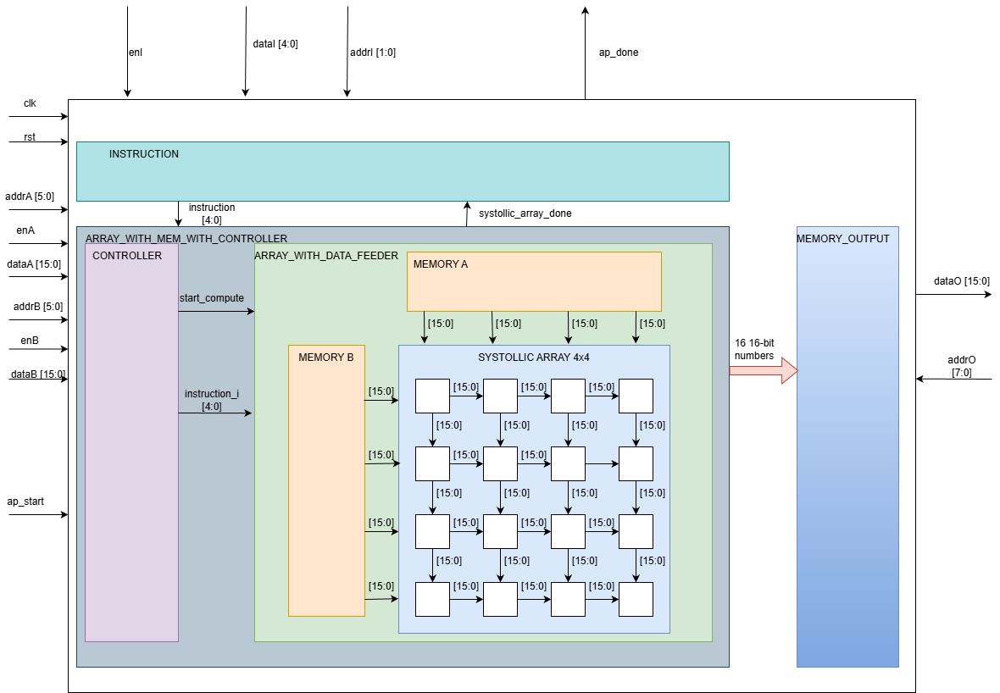
---

## Project Overview

My goal was to implement a complete hardware accelerator, not just the compute core. The design includes:

- A **4×4 systolic array** composed of processing elements (PEs)
- Two input memories (A and B) that feed data into the array
- An instruction memory that controls execution
- An output memory to store results
- A controller that orchestrates data movement and computation
- A full Verilog testbench and Python golden model for verification

The system supports multiple matrix sizes through an instruction stream and follows a clean `ap_start / ap_done` execution model.

---

## Fixed-Point Arithmetic

The design uses **16-bit fixed-point Q16.0 arithmetic**:
- Inputs (`a_i`, `b_i`) are signed 16-bit integers
- Each PE performs a **16×16 → 32-bit multiply**
- Accumulation is done using a wider internal accumulator
- Results are **saturated to signed 16-bit** (`[-32768, 32767]`) at the output
. 
This approach keeps the hardware simple and efficient while matching typical systolic-array behavior.

---

## Instruction Behavior
Instruction is a 5-bit integer representing the matrix size `N`.

- If instruction is `0`: **end of execution**
- Otherwise: perform one MMM of size:
  - **N×4** multiplied by **4×N** → **N×N**

Example instruction stream:
- `[4, 8, 16]`
  - compute **4×4 = (4×4) × (4×4)**
  - compute **8×8 = (8×4) × (4×8)**
  - compute **16×16 = (16×4) × (4×16)**
    
---

## Testbench Waveform
Memory A and Memory B each contain **64 addressable locations** (address range **0–63**).

### 1. Filling Memory A

As shown in **Figure 1 (pic1)** and **Figure 2 (pic2)**, the first step in the testbench is to initialize **Memory A**.  
All **64 entries of Memory A** are written sequentially using the signals **`enA`**, **`addrA`**, and **`dataA`**, which are highlighted in **blue** in the waveform.  
The data values are loaded from `a_file.txt` into addresses **0 through 63**.

---

### 2. Filling Memory B

After Memory A is fully initialized, the testbench proceeds to initialize **Memory B**. ( shown in **Figure 3 (pic3)** and **Figure 4 (pic4)**)
Memory B is written using the signals **`enB`**, **`addrB`**, and **`dataB`**, which are highlighted in **yellow** in the waveform.  
The data values for Memory B are loaded from `b_file.txt`.
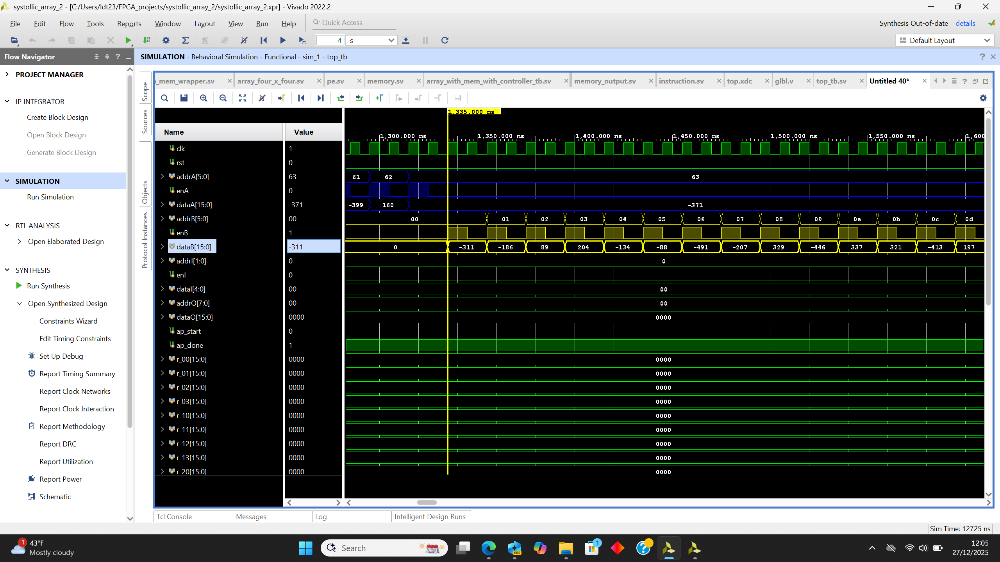

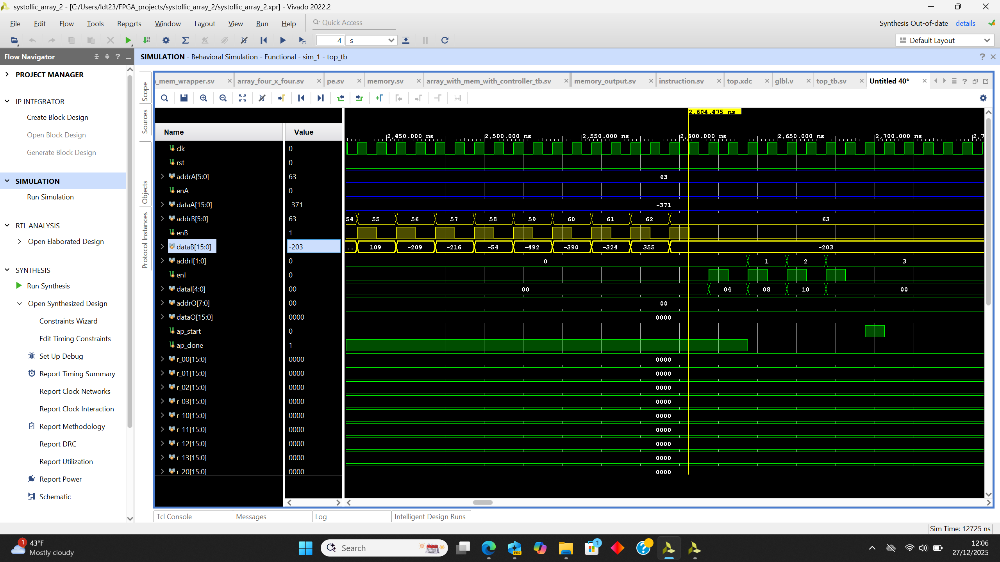

Although Memory A and Memory B support **simultaneous writes** through independent write interfaces, they are intentionally initialized **separately in the testbench**. This choice keeps the waveform cleaner and makes the memory initialization process easier to follow and debug.

---

### 3. Filling Instruction Memory
The instruction is a **5-bit value** that can take one of the following values: **0, 4, 8, or 16**.  
Each instruction specifies the matrix size to be executed, where an instruction value of **0** indicates the end of execution.

The instruction memory contains **4 addressable locations**, corresponding to **`addrI = 0, 1, 2, 3`**.  
As shown in **Figure 5 (pic5)**, I initialize the instruction memory using the signals highlighted in **pink** in the waveform.

Specifically:
- Instruction **4** is written to address `addrI = 0`
- Instruction **8** is written to address `addrI = 1`
- Instruction **16** is written to address `addrI = 2`
- Instruction **0** is written to address `addrI = 3`

This instruction sequence causes the accelerator to perform a **4×4**, followed by an **8×8**, and then a **16×16** matrix multiplication, after which execution terminates.
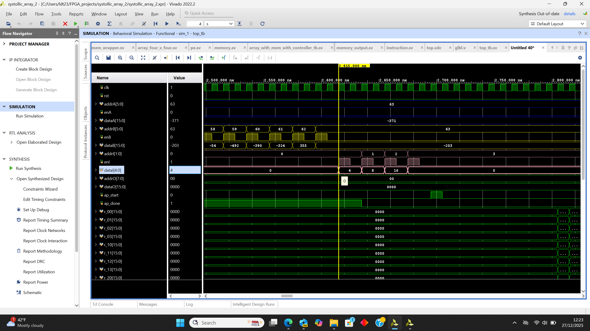

### 4. Set ap_start to 1 to make the system work (refer to the light blue signal on waveform)
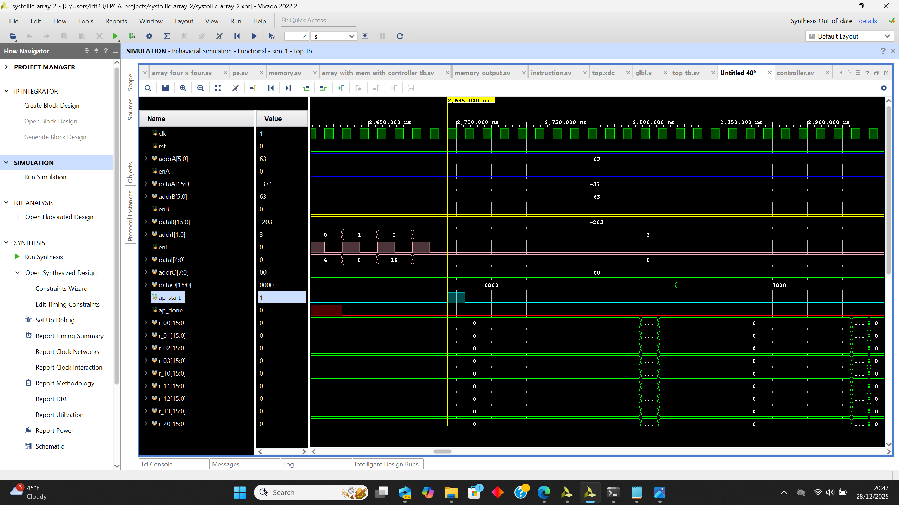
### 5. ap_done toggles from 0 to 1, which signals that the system has finished (refer to the red signal on waveform)
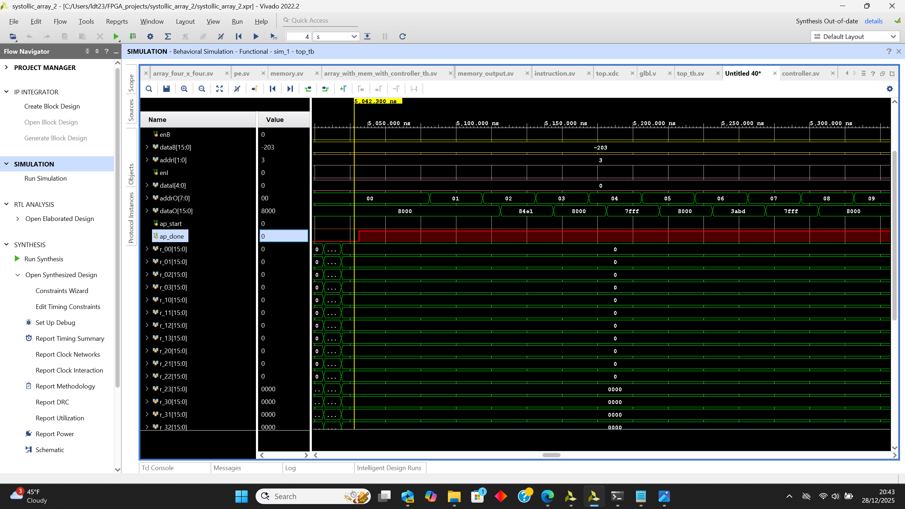
### 6. Set dataO from 0 to 255 to access the data saved in the memory output, then saved all the data into `c_out_file.txt` (refer to two orange signals addrO and dataO)
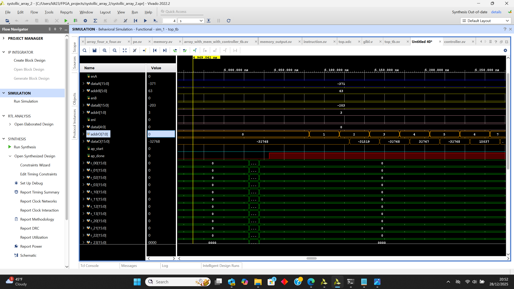
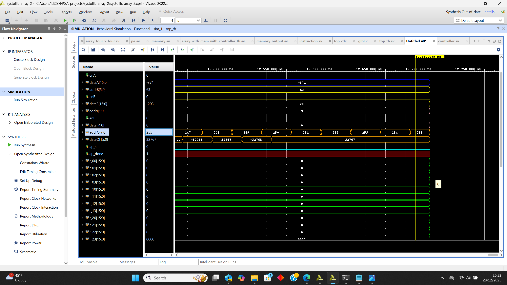
### 7. Use google colab to test with my Python model.
1. Navigate to the `sim/` directory.
2. Copy the provided Python code into `google_colab_test.py`.
3. Run the script in Google Colab to generate the input files `a_file.txt` and `b_file.txt`.
4. Use these files as inputs to the Vivado testbench.
5. The testbench generates `c_out_file.txt`, which is then imported back into Google Colab for result verification. You should download c_out_file.txt and put it into your google colab notebook before you run the python script.
### Picture: Output of A and B so you can see how the two data files look like
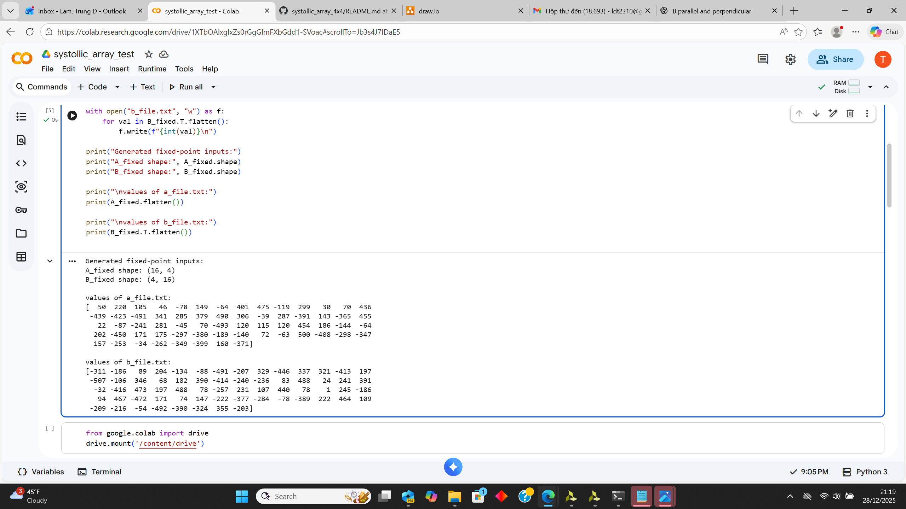
### Picture: Comparision between my output with my golden model (NO MISMATCHES HAPPENED)
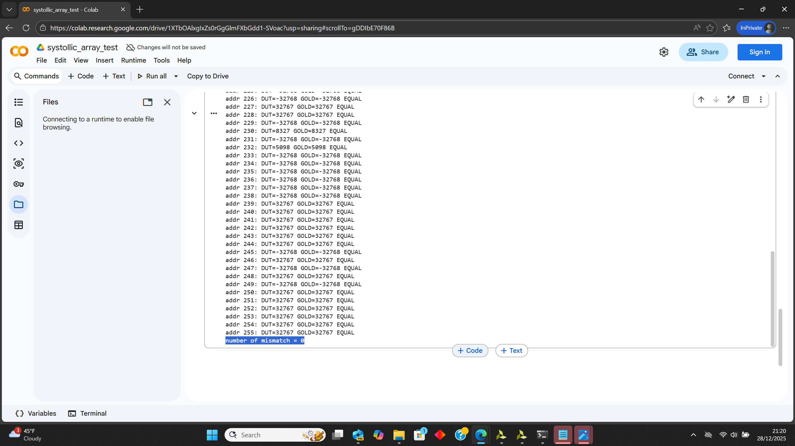
⚠️ **Important:** Verification with the Python model is performed only for the final instruction (`16`), as output memory is overwritten and data from previous instructions is not preserved.

## Architecture
Block diagram from vivado: we have memory_output that stores the output of the systollic array, instruction memory that stores instruction, and DUT block that contains the controller, two memory blocks A and B that feed the data into the array, and the 4x4 systollic array itself

### PICTURE 1: OVERALL Architecture
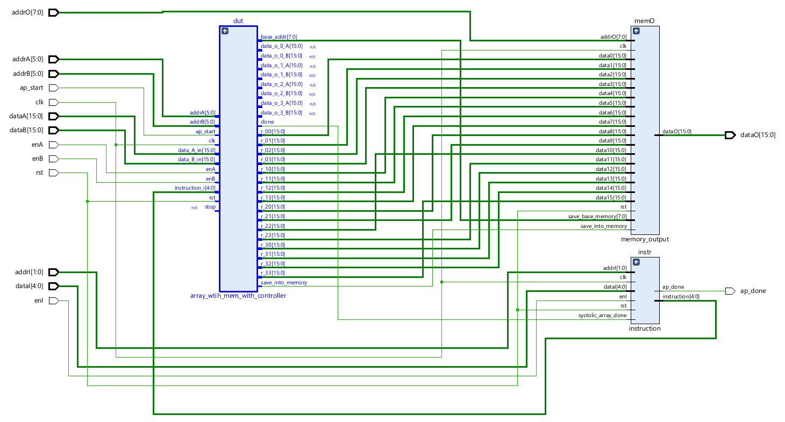
### PICTURE 2: DUT that consists of the systollic array 4x4, memory A and B, and controller
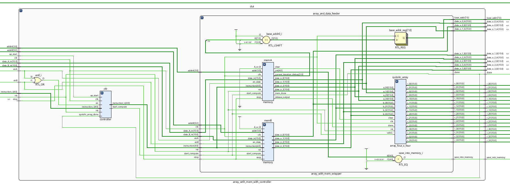

# Documentation

## Processing Element (PE)

### Overview
The `pe` module is a **signed multiply–accumulate (MAC) processing element** designed for systolic arrays. It multiplies two 16-bit signed inputs, accumulates the result internally, forwards operands to neighboring PEs, and outputs a **saturated 16-bit result** when computation is complete.

### Interface Summary
**Inputs:**  
`clk`, `rst`, `valid_i`, `clear`, `done`, `a_i`, `b_i`  

**Outputs:**  
`a_o`, `b_o`, `acc_o`

### Functionality
- Computes `a_i × b_i` using signed arithmetic.
- Accumulates results in a **40-bit internal accumulator** to prevent overflow.
- Accumulation occurs only when `valid_i` is asserted.
- When `done` is high, outputs the accumulated value with signed saturation (`±32767`).

### Notes
- Internal multiply width: 32 bits; accumulator width: 40 bits.
- `acc_o` remains `0` until `done` is asserted.

## 4×4 Systolic Array (`array_four_x_four`)

### Overview
`array_four_x_four` instantiates a **4×4 grid of `pe` modules** to implement a systolic-array style **matrix multiply / dot-product engine**. Inputs `a_*` stream **left → right** across each row, and inputs `b_*` stream **top → bottom** down each column. Each PE performs MAC accumulation and produces one output element `r_ij`.

### Inputs / Outputs
- **Inputs**
  - `clk`, `rst`: clock and synchronous reset
  - `valid_i`: enables MAC updates in all PEs
  - `clear`: clears PE accumulators (start of a new computation)
  - `done`: enables PE outputs to drive valid `r_ij`
  - `a_00, a_10, a_20, a_30`: 4 signed 16-bit values injected into the left edge (one per row)
  - `b_00, b_01, b_02, b_03`: 4 signed 16-bit values injected into the top edge (one per column)

- **Outputs**
  - r_00 ... r_33`: 16 signed 16-bit results (one per PE), produced with saturation inside each PE
    
Row 0 | r_00 | r_01 | r_02 | r_03 |

Row 1 | r_10 | r_11 | r_12 | r_13 |

Row 2 | r_20 | r_21 | r_22 | r_23 |

Row 3 | r_30 | r_31 | r_32 | r_33 |
### Dataflow (Systolic Connections)
- `a` values are forwarded horizontally via `a_o` wires: `pe_00 → pe_01 → pe_02 → pe_03`, etc.
- `b` values are forwarded vertically via `b_o` wires: `pe_00 → pe_10 → pe_20 → pe_30`, etc.
- `valid_i`, `clear`, and `done` are broadcast to all PEs to keep computation synchronized.

### Notes
- This module is structural wiring only; accumulation, saturation, and output gating behavior are handled inside `pe`.
- Typically, assert `clear` at the beginning of a dot-product phase, hold `valid_i` during streaming, then assert `done` to read `r_ij`.

## Memory Controller (`memory`)

### Overview
The `memory` module is a **64×16-bit scratchpad and streaming controller** designed to feed a **4×4 systolic array**. It supports tiled matrix multiplication for matrix sizes **4×4, 8×8, and 16×16** by breaking large matrices into **4×4 tiles**, streaming each tile into the array, and coordinating accumulator clearing and completion signaling.

The module provides **four parallel output ports**, allowing up to four values to be injected into the systolic array per cycle in a timing pattern that matches systolic dataflow.

---

### Interface Summary

### Inputs
- `clk`, `rst`  
  Clock and synchronous reset.

- `en_data`  
  Enables writes into the internal memory.

- `addr` (6-bit), `data_in` (signed 16-bit)  
  Write address and write data.

- `A_or_B`  
  Selects base address logic:
  - `0` → Matrix A addressing
  - `1` → Matrix B addressing

- `start_compute`  
  Starts streaming data to the systolic array.

- `stop`  
  Aborts computation and resets iteration counters.

- `instruction`  
  Matrix size selector:
  - `4`  → single 4×4 tile
  - `8`  → 8×8 matrix (4 tiles)
  - `16` → 16×16 matrix (16 tiles)

---

### Outputs
- `data_o_0 … data_o_3`  
  **Four parallel signed 16-bit output ports**.  
  These ports stream values from memory into the systolic array in a diagonal (wavefront) pattern.

- `clear`  
  Asserted at the end of each tile iteration to clear PE accumulators.

- `mem_done`  
  Asserted when all tile iterations complete.

- `release_output`  
  Timing pulse indicating results are ready to be captured.

- `cnt`, `current_iteration_debug`  
  Debug outputs exposing internal counters.

---

## Internal Organization

### Memory
- 64 entries of signed 16-bit data
- Each **4×4 tile occupies 16 consecutive addresses**
- Tile bases are always multiples of 16 (`<< 4`)

---

### Iteration Control
- `counter` (0–10): controls per-cycle streaming behavior. In each iteration, counter goes from 0 to 10, then go back to 0 when a new iteration starts
- `current_iteration`: selects the active tile 4x4 matrix pair from Memory A and Memory B
- `total_iteration`: derived from `instruction`  
  - `4`  → 1 iteration  
  - `8`  → 4 iterations  
  - `16` → 16 iterations  

Key events:
- `counter == 9`: end of one tile → assert `clear`
- `counter == 10`: assert `release_output` so the output in each PE can be saved into output memory
- Final tile completion → assert `mem_done`. This is to signal the instruction memory to move on to the next instruction
In each iteration, datas from Memory A and Memory B are streamed in the way shown in here 
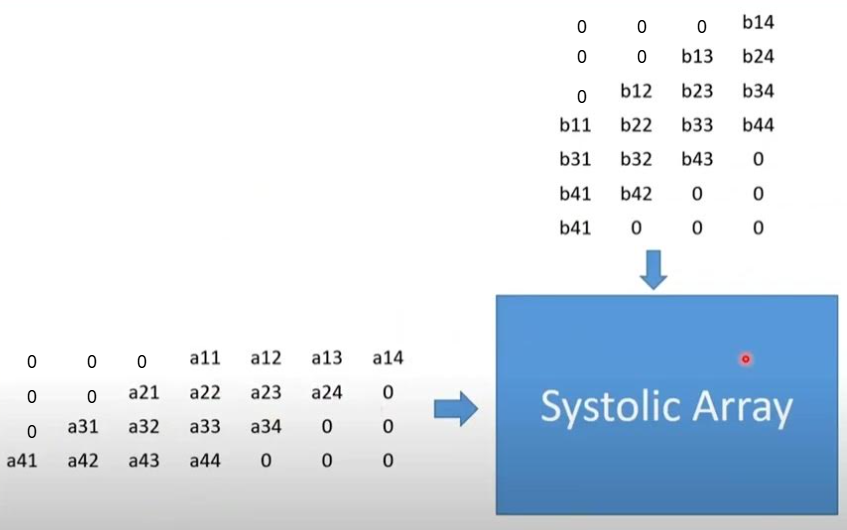
---
### IMPORTANT note: Internal signal `based_used` 
`base_used` → base address used to access the data stored in the memory of the current 4×4 tile. Base_used logic varies based on A_or_B (A_or_B is 0 means the memory block is memory A, otherwise it is memory block B) 
  During the **first iteration**, `base_used = 0`, so the 16 numbers with addresses `0` through `15` in the memory are fed into
  into the systollic array. For each subsequent iteration, `base_used` increases
  by `16`, and the next set of 16 data that are fed into the systollic array has the addresses from
  `base_addr + 0` through `base_addr + 15`. 

**Another important thing that you should know:** Each iteration takes 10 clock cycles, and the way we feed data depends on the signal `counter`. Please take a look at this video so you can visualize. This is how one iteration works:🎥 **https://www.youtube.com/watch?v=sJltBQ4MOHA**  

In each iteration, datas from Memory A and Memory B are streamed in the way shown in here 

---
## Array With Memory Wrapper (`array_with_mem_wrapper`)

### Overview
`array_with_mem_wrapper` is the **top-level module** that connects two memory controllers (`memA`, `memB`) to a **4×4 systolic array**. It manages data loading, tiled streaming, computation, and result timing for matrix sizes **4×4, 8×8, and 16×16**.

---

### Function
- Loads matrix **A** and **B** into separate memories.
- Streams up to **four values per cycle** from each memory into the systolic array.
- Controls accumulation (`clear`), result release, and iteration flow.
- Outputs **16 PE results** per tile and signals when results should be stored. (r00 to r33)

---

### Key Signals
- `start_compute` → starts streaming and MAC operations  
- `clear` → resets PE accumulators between tiles  
- `done` → asserted after all tiles complete. This is to tell the instruction memory that the current instruction has finished, and it is time to move on with the next instruction
- `save_into_memory` → pulse indicating results are valid to be saved into output memory
- `base_addr` → base address used to store the results of the current 4×4 tile.  
  During the **first iteration**, `base_addr = 0`, so the 16 PE outputs are written to
  addresses `0` through `15`. For each subsequent iteration, `base_addr` increases
  by `16`, and the next set of 16 results is written to
  `base_addr + 0` through `base_addr + 15`.
## Output Memory (`memory_output`)

### Overview

`memory_output` is a **256×16-bit result memory** used to store the outputs of the **4×4 systolic array**. Each computation tile produces **16 results**, which are written into memory in parallel using a base address. The module also supports synchronous read access for result retrieval.

---

### Functionality
- Stores **16 PE outputs at once** when `save_into_memory` is asserted.
- Uses `save_base_memory` as the starting address for the current 4×4 tile.
- Supports reading stored results using `addrO`.

---

### Write Behavior
- When `save_into_memory = 1`, the module writes:
  memory[base + 0] ← data0
  
  memory[base + 1] ← data1
  
  ...

  memory[base + 15] ← data15
  - `save_base_memory` must be ≤ 240 to prevent overflow (16 entries per tile).
- On reset, all memory locations are cleared to zero.

---

### Read Behavior
- Output `dataO` provides the value stored at address `addrO`.
- Read is **synchronous** (registered on the clock edge).

---

### Notes
- Designed to store tiled results for matrix sizes up to **16×16**.
- Each tile occupies **16 consecutive memory locations**.

## Instruction Controller (`instruction`)

### Overview
The `instruction` module implements a **small instruction memory and sequencer** for the systolic array system. It stores up to **4 instructions** (each 5 bits wide) and issues them **sequentially** to control matrix size and execution flow. The module automatically advances to the next instruction once the systolic array finishes the current operation.

---

### Functionality
- Provides a **4-entry instruction memory** (`instr_mem[0..3]`).
- Allows instructions to be written using `enI`, `addrI`, and `dataI`.
- Outputs the **current instruction** via the `instruction` signal.
- Advances to the next instruction when `systolic_array_done` is asserted.
- Signals completion using `ap_done` when a zero instruction (`5'd0`) is reached.

---

### Instruction Flow
1. Instructions are written into `instr_mem` at addresses `0–3`.
2. Execution starts from `instr_mem[0]`.
3. After each computation finishes (`systolic_array_done = 1`), the controller moves to the next instruction.
4. When the current instruction is `0`, `ap_done` is asserted, indicating all instructions are complete.

## Top-Level Module (`top`)

### Overview
`top` is the **system integration module** that connects:
- **Input memories** for A and B (inside the DUT),
- the **instruction sequencer** (`instruction`),
- the **compute core** (systolic array + controllers inside `array_wtih_mem_with_controller`),
- and the **output memory** (`memory_output`).

It provides a simple external interface to:
1) load matrices A and B,  
2) load up to 4 instructions,  
3) pulse `ap_start` to run,  
4) read results back through `addrO → dataO`,  
5) detect completion using `ap_done`.

---

### External Interface

#### Load Matrix A / B
- Write A: `enA`, `addrA`, `dataA`
- Write B: `enB`, `addrB`, `dataB`

#### Load Instruction Memory
- Write instruction: `enI`, `addrI`, `dataI`
- `dataI` is a 5-bit instruction (e.g., 4, 8, 16; 0 terminates)

#### Start / Done
- `ap_start`: pulse high to begin execution
- `ap_done`: asserted when the instruction controller reaches a `0` instruction

#### Read Output Memory
- `addrO`: 8-bit read address
- `dataO`: signed 16-bit output data at `addrO` (synchronous read)

---

### Internal Dataflow
- `array_wtih_mem_with_controller` generates:
  - PE outputs `r_00 … r_33`
  - `save_into_memory` pulse when results are valid
  - `save_base_memory` (tile base address)
  - `done` signal (`systolic_array_done`) after finishing all tiles for the current instruction

- `memory_output` stores each 4×4 tile result (16 values) as:
  - `memory[base + 0] … memory[base + 15]`

- `instruction` advances to the next instruction whenever `systolic_array_done` is asserted and sets `ap_done` when the current instruction becomes `0`.

---

### Notes
- `instruction_wave` is a debug tap of the active instruction.
- All 4×4 PE outputs are wired into output memory in row-major order:
  `r_00..r_03, r_10..r_13, r_20..r_23, r_30..r_33`.

---

### Notes
- Designed to support chained matrix operations (e.g., 4×4 → 8×8 → 16×16).

## PPA Report

### Performance
- Clock period:** **5.6 ns**  
- **Equivalent frequency:** **≈178.6 MHz**
- Setup WNS: **+1.205 ns**
- Setup TNS: **0.000 ns**
- Setup Failing Endpoints: **0**
- Hold WHS: **−0.016 ns**
- Hold THS: **−0.279 ns**
- Hold Failing Endpoints: **26**
- Pulse Width WNS: **+2.525 ns**
- Pulse Width Failing Endpoints: **0**

---

### Power
- Total On-Chip Power: **0.324 W**
- Dynamic Power: **0.035 W** (11%)
  - Clocks: **0.018 W** (52% of dynamic)
  - Signals: **0.002 W** (5%)
  - Logic: **0.005 W** (15%)
  - DSPs: **0.002 W** (7%)
  - I/O: **0.007 W** (21%)
- Static (Leakage) Power: **0.288 W** (89%)

- Junction Temperature: **25.8 °C**
- Effective θJA: **2.3 °C/W**
- Confidence Level: **Low** (synthesis-based estimate)

---

### Area
- LUTs: **3,496** (2.98%)
- Flip-Flops: **6,356** (2.71%)
- DSPs: **16** (1.28%)
- BRAM: **0**
- URAM: **0**
- IOBs: **82** (43.39%)
- BUFGs: **1**

  Refer to **`top_utilization_synth.rpt`** for detailed area utilization

